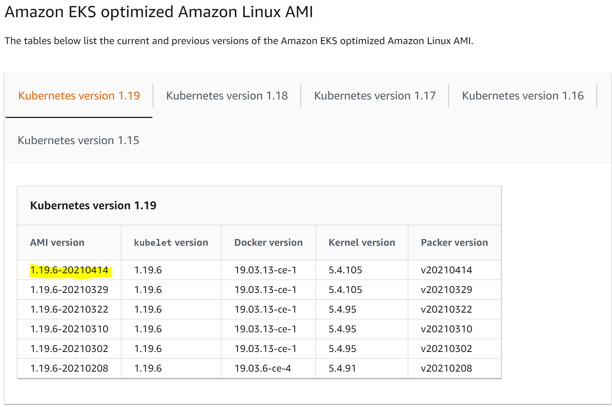

# EKS Quickstart

This project is an example of how you can combine the AWS Cloud Development Kit (CDK) and the AWS Elastic Kubernetes Serivce (EKS) to quickly deploy a more complete and "production ready" Kubernetes environment on AWS.

I describe it a bit more in a recent blog post - https://jason-umiker.medium.com/automating-the-provisioning-of-a-production-ready-kubernetes-cluster-with-aws-eks-cdk-b1f0e8a12723

## What does this QuickStart create for you:

1. An appropriate VPC (/22 CDIR w/1024 IPs by default - though you can edit this in `eks_cluster.py`) with public and private subnets across three availabilty zones.
    1. Alternatively, just flip `create_new_vpc` to `False` and then specify the name of your VPC under `existing_vpc_name` in `eks_cluster.py`
1. A new EKS cluster with:
    1. A dedicated new IAM role to create it from. The role that creates the cluster is a permanent, and rather hidden, full admin role that doesn't appear in nor is subject to the aws-auth config map. So, you want a dedicated role explicity for that purpose like CDK does for you here that you can then restrict access to assume unless you need it (e.g. you lock yourself out of the cluster with by making a mistake in the aws-auth configmap).
    1. A new Managed Node Group with 3 x m5.large instances spread across 3 Availability Zones.
        1. You can change the instance type and quantity by changing `eks_node_quantity` and/or `eks_node_type` at the top of `cluster-bootstrap/eks-clustery.py`.
    3. All control plane logging to CloudWatch Logs enabled (defaulting to 1 month's retention within CloudWatch Logs).
1. The AWS Load Balancer Controller (https://kubernetes-sigs.github.io/aws-load-balancer-controller) to allow you to seamlessly use ALBs for Ingress and NLB for Services.
1. External DNS (https://github.com/kubernetes-sigs/external-dns) to allow you to automatically create/update Route53 entries to point your 'real' names at your Ingresses and Services.
1. A new managed Amazon Elasticsearch Domain behind a private VPC endpoint as well as an aws-for-fluent-bit DaemonSet (https://github.com/aws/aws-for-fluent-bit) to ship all your container logs there - including enriching them with the Kubernetes metadata using the kubernetes fluent-bit filter.
1. (Temporarily until the AWS Managed Prometheus/Grafana are available) The kube-prometheus Operator (https://github.com/prometheus-operator/kube-prometheus) which deploys you a Prometheus on your cluster that will collect all your cluster metrics as well as a Grafana to visualise them.
    1. TODO: Add some initial alerts for sensible common items in the cluster via Prometheus/Alertmanager
1. The AWS EBS CSI Driver (https://github.com/kubernetes-sigs/aws-ebs-csi-driver). Note that new development on EBS functionality has moved out of the Kubernetes mainline to this externalised CSI driver.
1. The AWS EFS CSI Driver (https://docs.aws.amazon.com/eks/latest/userguide/efs-csi.html). Note that new development on EFS functionality has moved out of the Kubernetes mainline to this externalised CSI driver.
1. An OPA Gatekeeper to enforce prevenetative secruity and operational policies (https://github.com/open-policy-agent/gatekeeper). A default set of example policies is deployed by default - see `gatekeeper-policies/README.md`
1. The cluster autoscaler (CA) (https://github.com/kubernetes/autoscaler). This will scale your EC2 instances to ensure you have enough capacity to launch all of your Pods as they are deployed/scaled.
1. The metrics-server (required for the Horizontal Pod Autoscaler (HPA)) (https://github.com/kubernetes-sigs/metrics-server)
1. The Calico Network Policy Provider (https://docs.aws.amazon.com/eks/latest/userguide/calico.html). This enforces any [NetworkPolicies](https://kubernetes.io/docs/concepts/services-networking/network-policies/) that you specify.
1. The AWS Systems Manager (SSM) agent. This allows for various management activities (e.g. Inventory, Patching, Session Mnaager, etc.) of your Instances/Nodes by AWS Systems Manager.

All of the add-ons are optional and you control whether you get them with variables at the top of `cluster-bootstrap\eks_cluster.py` that you flip to True/False

### Why Cloud Development Kit (CDK)?

The Cloud Development Kit (CDK) is a tool where you can write infrastucture-as-code with 'actual' code (TypeScript, Python, C#, and Java). This takes these lanugages and 'compiles' them into a CloudFormation template for the AWS CloudFormation engine to then deploy and manage as stacks.

When you develop and deploy infrastructure with the CDK you don't edit the intermediate CloudFormation but, instead, let CDK regenerate it in reponse to changes in the upstream CDK code.

What makes CDK uniquely good when it comes to our EKS Quickstart is:

* It handles the IAM Roles for Service Accounts (IRSA) rather elegantly and creates the IAM Roles and Policies, creates the Kubernetes service accounts, and then maps them to each other.
* It has implemented custom CloudFormation resources with Lambda invoking kubectl and helm to deploy manifests and charts as part of the cluster provisioning.
    * Until we have [Managed Add-Ons](https://aws.amazon.com/blogs/containers/introducing-amazon-eks-add-ons/) for the common things with EKS like the above this can fill the gap and provision us a complete cluster with all the add-ons we need.

## Getting started

You can either deploy this from your machine or leverge CodeBuild. 

###  Deploy from CodeBuild
To use the CodeBuild CloudFormation Template:

1. Generate a personal access token on GitHub - https://docs.github.com/en/github/authenticating-to-github/creating-a-personal-access-token 
1. Edit `cluster-codebuild/EKSCodeBuildStack.template.json` to change Location to your GitHub repo/path
1. Run `aws codebuild import-source-credentials --server-type GITHUB --auth-type PERSONAL_ACCESS_TOKEN --token <token_value>` to provide your token to CodeBuild
1. Deploy `cluster-codebuild/EKSCodeBuildStack.template.json`
1. Go to the CodeBuild console, click on the Build project that starts with `EKSCodeBuild`, and then click the Start build button.
1. (Optional) You can click the Tail logs button to follow along with the build process

**_NOTE:_** This also enables a GitOps pattern where changes to the cluster-bootrap folder on the branch mentioned (main by default) will re-trigger this CodeBuild to do another `cdk deploy` via web hook.

### Deploy from your laptop
There are some prerequsistes you likely will need to install on the machine doing your environment bootstrapping including Node, Python, the AWS CLI, the CDK, fluxctl and Helm

#### Pre-requisites - Ubuntu 20.04.2 LTS (including via Windows 10's WSL)
Run `sudo ./ubuntu-prepreqs.sh`

#### Pre-requisites - Mac

1. Install Homebrew (https://brew.sh/)
1. Run `./mac-prereqs.sh`
1. Edit your `~/.zshrc` and/or your `~/.bash_profile` to put /usr/local/bin at the start of your PATH statement so that the brew things installed take precendence over the built-in often outdated options like python2.

#### Deploy from CDK locally

1. Make sure that you have your AWS CLI configured with administrative access to the AWS account in question (e.g. an `aws s3 ls` works)
    1. This can be via setting your access key and secret in your .aws folder via `aws configure` or in your environment variables by copy and pasting from AWS SSO etc.
1. Run `cd eks-quickstart/cluster-bootstrap`
2. Run `sudo npm install --upgrade -g aws-cdk` to ensure your CDK is up to date
3. Run `pip install --upgrade -r requirements.txt` to install the required Python bits of the CDK
4. Run `export CDK_DEPLOY_REGION=ap-southeast-2` replacing ap-southeast-2 with your region of choice
5. Run `export CDK_DEPLOY_ACCOUNT=123456789123` replacing 123456789123 with your AWS account number
6. (Optional) If you want to make an existing IAM User or Role the cluster admin rather than creating a new one then edit `eks_cluster.py` and comment out the curernt cluster_admin_role and uncomment the one beneath it and fill in the ARN of the User/Role you'd like there.
7. (Only required the first time you use the CDK in this account) Run `cdk bootstrap` to create the S3 bucket where it puts the CDK puts its artifacts
8. (Only required the first time ES in VPC mode is used in this account) Run `aws iam create-service-linked-role --aws-service-name es.amazonaws.com`
9. Run `cdk deploy --require-approval never`

### Finish setup of Flux for GitOps deployment of gatekeeper-policies

We've deployed Flux to deploy - and then keep in sync via GitOps - our default Gatekeeper policies and constraints. In order for that to work, though, we'll need to get the SSH key that Flux generated and add it to GitHub to give us the required access.

fluxctl and the required access is set up on the Bastion - if you have deployed that:

1. Connect to the Bastion via Systems Manager Session Manager or code-server
1. Run `fluxctl identity --k8s-fwd-ns kube-system`
1. Take the SSH key that has been ouput and add it to GitHub by following these instructions - https://docs.github.com/en/github/authenticating-to-github/adding-a-new-ssh-key-to-your-github-account
1. (Optional) If you don't want to wait up to 5 minutes for Flux to sync you can run `fluxctl sync --k8s-fwd-ns kube-system`

## Deploy and set up a Bastion based on an EC2 instance running Code Server

If you set `deploy_bastion` to `True` in `eks_cluster.py` then the template will deploy an EC2 instance running [Code Server](https://github.com/cdr/code-server) which is Visual Studio Code but running in your browser.

So there are two ways to reach your Bastion and, through it, your EKS cluster:

### Via Systems Manager Session Manager

1. Go to the Systems Manager Server in the AWS Console
1. Go to Managed Instances on the left hand navigation pane
1. Select the instance with the name `EKSClusterStack/CodeServerInstance`
1. Under the Instance Actions menu on the upper right choose Start Session
1. You need to run `sudo bash` to get to root's profile where we've set up kubectl
1. Run `kubectl get nodes` to see that all the tools are there and set up for you.

### Via the code-server (VSCode in a browser) server on the Bastion

The stack will have an Output with the address to the Bastion and the password for the web interface defaults to the Instance ID of the Bastion Instance (which you can get from the EC2 Console).

**_NOTE:_** Since this defaults to HTTP rather than HTTPS to accomodate accounts without a public Route 53 Zone and associated certificates that means that modern browsers won't allow you to paste with Ctrl-V. You can, however, paste with shift-insert (insert = fn + return on a Mac so shift-fn-return on a Mac to paste).

Here are a few things to familiarise yourself with the Bastion:

- Click the three dashes (I call it the hambuger menu) in the upper left corrner then click `Terminal` and then `New Terminal`.
- Run `kubectl get nodes` and see that we've already installed the tools for you and run the `aws eks update-kubeconfig` and it is all working
- Click the three dashes in the upper left then click View then Command Palette. In that box type Browser Preview and choose `Browser Preview: Open Preview`. This browser is running on the Instance in the private VPC and you can use this browser to reach Kibana and Grafana etc.

## Set up your Client VPN to access the environment

If you set `deploy_vpn` to `True` in `eks_cluster.py` then the template will deploy a Client VPN.

Note that you'll also need to create client and server certificates and upload them to ACM by following these instructions - https://docs.aws.amazon.com/vpn/latest/clientvpn-admin/client-authentication.html#mutual - and update `ekscluster.py` with the certificate ARNs for this to work.

Once it has created your VPN you then need to configure the client:

1. Open the AWS VPC Console and go to the Client VPN Endpoints on the left panel
1. Click the Download Client Configuration button
1. Edit the downloaded file and add:
    1. A section at the bottom for the server cert in between <cert> and </cert>
    1. Then under that a section for the client private key between <key> and </key>
1. Install the AWS Client VPN Client - https://aws.amazon.com/vpn/client-vpn-download/
1. Create a new profile pointing it at that configuration file
1. Connect to the VPN

Once you are connected it is a split tunnel - meaning only the addresses in your EKS VPC will get routed through the VPN tunnel.

You then need to add the EKS cluster to your local kubeconfig by running the command in the clusterConfigCommand Output of the EKSClusterStack.

Then you should be able to run a `kubectl get all -A` and see everything running on your cluster.

## Allow access to the Elasticsearch and Kibana to query your logs

We put the Elasticsearch both in the VPC (i.e. not on the Internet) as well as within the same Security Group we use for controlling access to our EKS Control Plane.

We did this so that when we allow the Bastion or Client VPN access to that security group then it has access from a network perspective to *both* manage EKS as well as query logs in Elasticsearch/Kibana.

Since this ElasticSearch can only be reached if you are coming in via the Bastion/VPC/DirectConnect, then it is not that risky to allow 'open access' to it - especially in a Proof of Concept (POC) environment. As such, we've configured its default access policy so that no login and password and are controlling access to it form a network perspective rahter than with authentiation/authorization by default.

### Connect to Kibana and do initial setup

1. Once that new access policy has applied click on the Kibana link on the Elasticsearch Domain's Overview Tab
1. Click "Explore on my own" in the Welcome page
1. Click "Connect to your Elasticsearch index" under "Use Elasticsearch Data"
1. Close the About index patterns box
1. Click the Create Index Pattern button
1. In the Index pattern name box enter `fluent-bit*` and click Next step
1. Pick @timestamp from the dropbown box and click Create index pattern
1. Then go back Home and click Discover

TODO: Walk through how to do a few basic things in Kibana with searching and dashboarding your logs.

## Checking out Grafana and the out-of-the-box metrics dashboards

We have deployed an in-VPC private Network Load Balancer (NLB) to access your Grafana service to visualise the metrics from the Prometheus we've deployed onto the cluster.

To access this enter the following command `get service grafana-nlb --namespace=kube-system` to find the address of this under EXTERNAL-IP. Alternatively, you can find the Grafana NLB in the AWS EC2 console and get its address from there.

Once you go to that page the default login/password is admin/prom-operator.

There are some default dashboards that ship with this which you can see by going to Home on top. This will take you to a list view of the available dashboards. Some good ones to check out include:

- Kubernetes / Compute Resources / Cluster
    - This gives you a whole cluster view
- Kubernetes / Compute Resources / Namespace (Pods)
    - There is a namespace dropdown at the top and it'll show you the graphs including the consumption in that namespace broken down by Pod
- Kubernetes / Compute Resources / Namespace (Workloads)
    - Similar to the Pod view but instead focuses on Deployment, StatefulSet and DaemonSet views

Within all of these dashboards you can click on names as links and it'll drill down to show you details relevant to that item.

## Deploy some sample apps to explore our new Kubernetes environment and its features

TODO: Walk through deploying some apps that show off some of the cluster add-ons we've installed

## Upgrading your cluster

Since we are explicit both with the EKS Control Plane version as well as the Managed Node Group AMI version upgrading these is simply incrementing these versions, saving `cluster-bootstrap/eks_cluster.py` and then running a `cdk deploy`.

As per the [EKS Upgrade Instructions](https://docs.aws.amazon.com/eks/latest/userguide/update-cluster.html) you start by upgrading the control plane, then any required add-on versions and then the worker nodes.

Upgrade the control plane by changing `eks_version` at the top of `eks_cluster.py`. You can see what to put there by looking at the [CDK documentation for KubernetesVersion](https://docs.aws.amazon.com/cdk/api/latest/python/aws_cdk.aws_eks/KubernetesVersion.html). Then run `cdk deploy` - or let the CodeBuild GitOps provided in `cluster-codebuild` do it for you.

Upgrade the worker nodes by updating `eks_node_ami_version` at the top of `cluster-bootstrap/eks_cluster.py` with the new version. You find the version to type there in the [EKS Documentation](https://docs.aws.amazon.com/eks/latest/userguide/eks-linux-ami-versions.html) as shown here:

## Upgrading an add-on

Each of our add-ons are deployed via Helm Charts and are explicit about the chart version being deployed. In the comment above each chart version we link to the GitHub repo for that chart where you can see what the current chart version is and can see what changes may have been rolled in since the one cited in the template.

To upgrade the chart version update the chart version to the upstream version you see there, save it and then do a `cdk deploy`.

**NOTE:** I was thinking about parametising this to the top of `cluster-bootstrap/eks_cluster.py` but it is possible as the Chart versions change that the values you have to specify might also change. As such I have not done so as a reminder that this change might require a bit of testing and research rather than just popping a new version number in and expecting it'll work

## Outstanding Issues

* Investigate replacing the current instance ID password for the VS Code on the Bastion with something more secure such as generating a longer string and storing it in Secrets Manager - or drop it alltogether in lieu of just the Client VPN and/or Systems Manager Session Manager to the Bastion.
